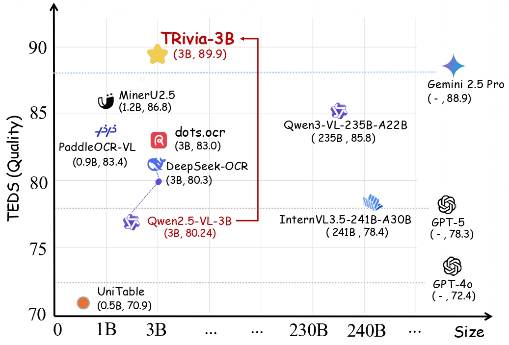
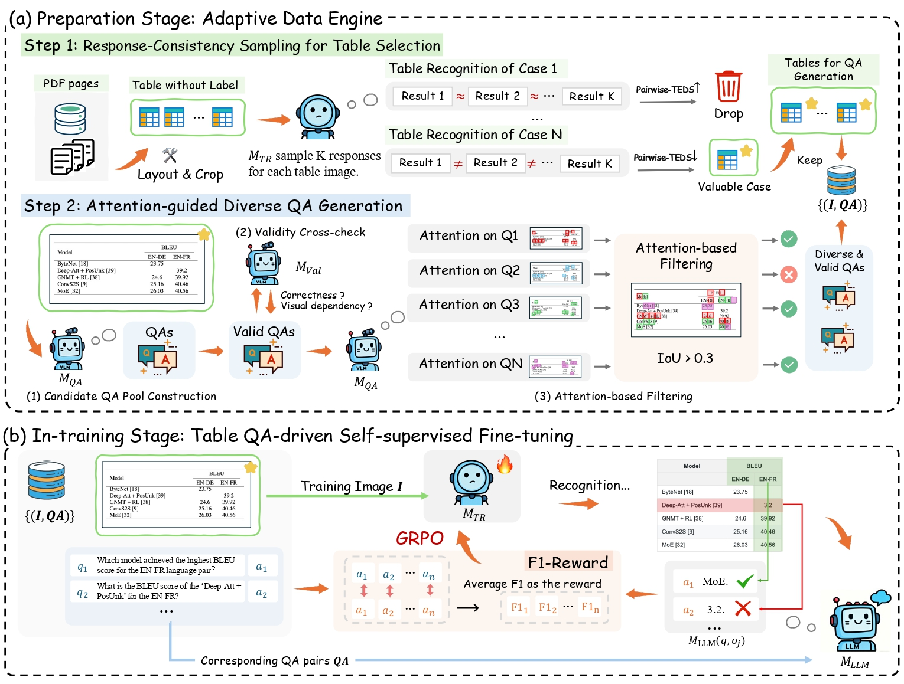

<div align="center">

English | [简体中文](./README_zh.md)

</div>

<h1 align="center">
TRivia: Self-supervised Fine-tuning of Vision-Language Models for Table Recognition
</h1>

<p align="center">
  <br>
</p>

<p align="center">
<a href=""><b>📜 arXiv</b></a> |
<a href="https://github.com/opendatalab/TRivia"><b>Github</b></a> |
<a href="https://huggingface.co/spaces/opendatalab/TRivia-3B"><b>🤗 Huggingface Demo</b></a>
<a href="https://huggingface.co/Carkham/TRivia"><b>🤗 Huggingface Model</b></a>
</p>

TRivia is a novel self-supervised fine-tuning framework of vision-language models for table recognition. This repository contains the **TRivia-3B**, an advanced table recognition VLMs trained from Qwen2.5-VL-3B using TRivia, and demo code. TRivia-3B has demonstrated superior performance on multiple real-world table recognition benchmarks.

# News
- 2025.12.26 We have released the [training code](./training) of TRivia.

# Key Features:
- ⭐ Powerful table recognition capabilities, generalizing across digital tables, scanned tables, and photographed tables.
- 📃 Reproducible training framework that pushes the boundaries of table recognition capabilities using unlabeled table images.

<p align="center">
  <br>
</p>

# Benchmark Performance
We compare the performance of TRivia-3B with other table recognition solution on three benchmarks: [OmnidocBench v1.5](https://github.com/opendatalab/OmniDocBench), [CC-OCR](https://github.com/AlibabaResearch/AdvancedLiterateMachinery/tree/main/Benchmarks/CC-OCR) and [OCRBench v2](https://github.com/Yuliang-Liu/MultimodalOCR)

<table>
  <thead>
    <tr>
      <th></th>
      <th colspan="2">PubTabNet</th>
      <th colspan="2">OmniDocBench</th>
      <th colspan="2">CC-OCR</th>
      <th colspan="2">OCRBench</th>
      <th colspan="2">Overall</th>
    </tr>
    <tr>
      <th></th>
      <th>TEDS</th>
      <th>S-TEDS</th>
      <th>TEDS</th>
      <th>S-TEDS</th>
      <th>TEDS</th>
      <th>S-TEDS</th>
      <th>TEDS</th>
      <th>S-TEDS</th>
      <th>TEDS</th>
      <th>S-TEDS</th>
    </tr>
  </thead>
  <tbody>
    <tr>
      <td colspan="11">Expert TR models</td>
    </tr>
    <tr>
      <td>SLANNet-plus</td>
      <td>86.57</td>
      <td><b>96.43</b></td>
      <td>81.90</td>
      <td>89.08</td>
      <td>50.93</td>
      <td>65.84</td>
      <td>65.55</td>
      <td>77.73</td>
      <td>68.19</td>
      <td>79.21</td>
    </tr>
    <tr>
      <td>UniTable</td>
      <td>86.44</td>
      <td><u>95.66</u></td>
      <td>82.76</td>
      <td>89.82</td>
      <td>57.84</td>
      <td>70.47</td>
      <td>67.73</td>
      <td>78.65</td>
      <td>70.86</td>
      <td>80.81</td>
    </tr>
    <tr>
      <td colspan="11">General-purpose VLMs</td>
    </tr>
    <tr>
      <td>InternVL3.5-241B-A30B</td>
      <td>83.75</td>
      <td>88.76</td>
      <td>86.03</td>
      <td>90.53</td>
      <td>62.87</td>
      <td>69.52</td>
      <td>79.50</td>
      <td>85.81</td>
      <td>78.41</td>
      <td>84.18</td>
    </tr>
    <tr>
      <td>Qwen2.5-VL-72B</td>
      <td>84.39</td>
      <td>87.91</td>
      <td>87.85</td>
      <td>91.80</td>
      <td>81.22</td>
      <td>86.48</td>
      <td>81.33</td>
      <td>86.58</td>
      <td>83.52</td>
      <td>88.33</td>
    </tr>
    <tr>
      <td>Qwen3-VL-235B-A22B</td>
      <td>-</td>
      <td>-</td>
      <td>91.02</td>
      <td><u>94.97</u></td>
      <td>80.98</td>
      <td>86.19</td>
      <td>84.12</td>
      <td>88.15</td>
      <td>85.83</td>
      <td>90.07</td>
    </tr>
    <tr>
      <td>Gemini 2.5 Pro</td>
      <td>-</td>
      <td>-</td>
      <td>90.90</td>
      <td>94.32</td>
      <td><b>85.56</b></td>
      <td><u>90.07</u></td>
      <td>88.94</td>
      <td>89.47</td>
      <td><u>88.93</u></td>
      <td><u>91.23</u></td>
    </tr>
    <tr>
      <td>GPT-4o</td>
      <td>76.53</td>
      <td>86.16</td>
      <td>78.27</td>
      <td>84.56</td>
      <td>66.98</td>
      <td>79.04</td>
      <td>70.51</td>
      <td>79.55</td>
      <td>72.44</td>
      <td>81.15</td>
    </tr>
    <tr>
      <td>GPT-5</td>
      <td>-</td>
      <td>-</td>
      <td>84.91</td>
      <td>89.91</td>
      <td>63.25</td>
      <td>74.09</td>
      <td>79.91</td>
      <td>88.69</td>
      <td>78.30</td>
      <td>86.21</td>
    </tr>
    <tr>
      <td colspan="11">Document-parsing VLMs</td>
    </tr>
    <tr>
      <td>dots.ocr</td>
      <td>90.65</td>
      <td>93.76</td>
      <td>88.62</td>
      <td>92.86</td>
      <td>75.42</td>
      <td>81.65</td>
      <td>82.04</td>
      <td>86.27</td>
      <td>82.95</td>
      <td>87.58</td>
    </tr>
    <tr>
      <td>DeepSeek-OCR</td>
      <td>-</td>
      <td>-</td>
      <td>83.79</td>
      <td>87.86</td>
      <td>68.95</td>
      <td>75.22</td>
      <td>82.64</td>
      <td>87.33</td>
      <td>80.31</td>
      <td>85.11</td>
    </tr>
    <tr>
      <td>PaddleOCR-VL</td>
      <td>-</td>
      <td>-</td>
      <td><u>91.12</u></td>
      <td>94.62</td>
      <td>79.62</td>
      <td>85.04</td>
      <td>79.29</td>
      <td>83.93</td>
      <td>83.36</td>
      <td>87.77</td>
    </tr>
    <tr>
      <td>MinerU2.5</td>
      <td>89.07</td>
      <td>93.11</td>
      <td>90.85</td>
      <td>94.68</td>
      <td>79.76</td>
      <td>85.16</td>
      <td><u>87.13</u></td>
      <td><u>90.62</u></td>
      <td>86.82</td>
      <td>90.81</td>
    </tr>
    <tr>
      <td><b>TRivia-3B(Ours)</b></td>
      <td><b>91.79</b></td>
      <td>93.81</td>
      <td><b>91.60</b></td>
      <td><b>95.01</b></td>
      <td><u>84.90</u></td>
      <td><b>90.17</b></td>
      <td><b>90.76</b></td>
      <td><b>94.03</b></td>
      <td><b>89.88</b></td>
      <td><b>93.60</b></td>
    </tr>
  </tbody>
</table>
The overall performance indicates the weighted average score across OmniDocBench v1.5, CC-OCR, and OCRBench v2.

# Installation
TRivia-3B is trained based on Qwen2.5-VL-3B so that you can follow the [Qwen2.5-VL-3B installation guide](https://github.com/QwenLM/Qwen3-VL?tab=readme-ov-file#quickstart). 

We highly recommend installing [`vLLM >= 0.7.2`](https://github.com/vllm-project/vllm) to improve inference speed.

# Usage
TRivia-3B supports table parsing with table images as input and outputting OTSL tags as results.

> TRivia-3B is an experimental model, and it currently does not support parsing formulas in tables or tables with images.

## Using vLLM for offline inference
Make sure you have installed `vllm >= 0.7.2`. Prepare your table images in a folder and run the following command:

```bash
python run_vllm_offline_inf.py --ckpt_root opendatalab/TRivia-3B --image_root /path/to/images --output_path ./vllm_offline_output.json
# Examples
python run_vllm_offline_inf.py --ckpt_root opendatalab/TRivia-3B --image_root ./examples --output_path ./examples_output.json
```

The output is a JSON file ([example](./example.json)) which is formatted as folows:
```json
[
    {
        "path": "...", // Image path
        "otsl": "...", // Unprocessed OTSL tags output by the model
        "html": "...", // Converted HTML tags
    }
]
```

## Using vLLM for online deployment
You can start either a vLLM or SGLang server to serve LLMs efficiently, and then access it using an OpenAI-style API.

- Start vLLM Server
```bash
vllm serve opendatalab/TRivia-3B --port 10000 --gpu_memory_utilization 0.8 
```
- Table Image Request
```python
import base64
from openai import OpenAI
from otsl_utils import convert_otsl_to_html

client = OpenAI(
    api_key="EMPTY",
    base_url="http://127.0.0.1:10000/v1",
    timeout=3600
)

image_path = "./examples/docstructbench_llm-raw-scihub-o.O-ijc.22994.pdf_3_5.png"
with open(path, "rb") as image_file:
    base64_image = base64.b64encode(image_file.read()).decode('utf-8')

messages = [
    {
        "role": "user",
        "content": [
            {
                "type": "text",
                "text": "You are an AI specialized in recognizing and extracting table from images. Your mission is to analyze the table image and generate the result in OTSL format using specified tags. Output only the results without any other words and explanation." # Make sure to use this prompt for optimal performance.
            },
            {
                "type": "image_url",
                "image_url": {"url": f"data:image/jpeg;base64,{base64_image}"}
            }
        ]
    }
]

response = client.chat.completions.create(
    model="opendatalab/TRivia-3B",
    messages=messages,
    temperature=0.0,
    max_tokens=8192
)
otsl_content = response.choices[0].message.content
html_content = convert_otsl_to_html(otsl_content)
print(f"Generated otsl tags: {otsl_content}")
print(f"HTML table: {html_content}")
```

## Training with TRivia
Please refer [training](./training) for more details.

## TODO
[✅] Release inference code and checkpoints of TRivia-3B.  
[✅] Release training code of TRivia.  
[] Release training data generation pipeline.

# Citation

```
@misc{zhang2025triviaselfsupervisedfinetuningvisionlanguage,
      title={TRivia: Self-supervised Fine-tuning of Vision-Language Models for Table Recognition}, 
      author={Junyuan Zhang and Bin Wang and Qintong Zhang and Fan Wu and Zichen Wen and Jialin Lu and Junjie Shan and Ziqi Zhao and Shuya Yang and Ziling Wang and Ziyang Miao and Huaping Zhong and Yuhang Zang and Xiaoyi Dong and Ka-Ho Chow and Conghui He},
      year={2025},
      eprint={2512.01248},
      archivePrefix={arXiv},
      primaryClass={cs.CV},
      url={https://arxiv.org/abs/2512.01248}, 
}
```


# License
[Apache License 2.0](LICENSE)

# Acknowledgments
We would like to thank [ms-swift](https://github.com/modelscope/ms-swift), [MinerU](https://github.com/opendatalab/MinerU), [DocLayout-YOLO](https://github.com/opendatalab/DocLayout-YOLO), [Qwen2.5-VL](https://github.com/QwenLM/Qwen2.5-VL), and [InternVL3](https://github.com/OpenGVLab/InternVL) for providing base code and models, as well as their contributions to this field.
